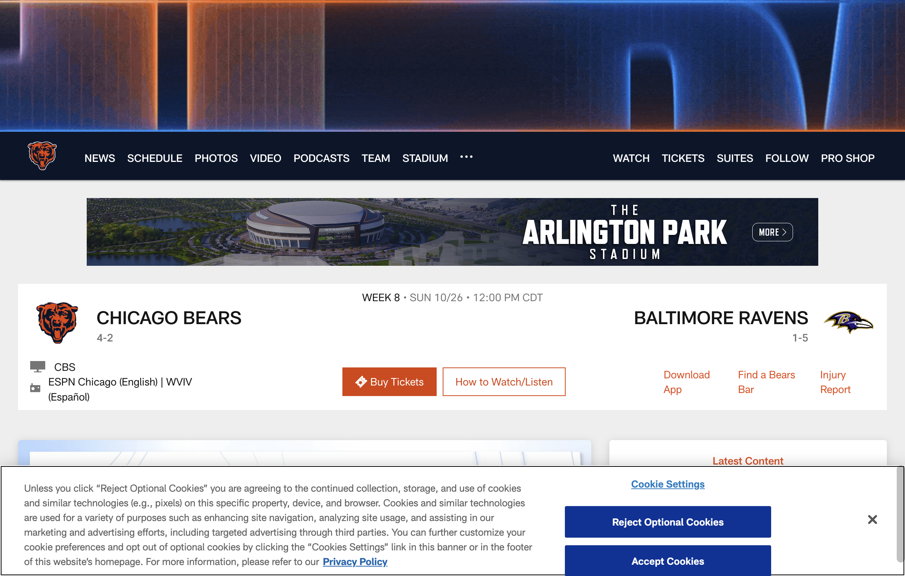
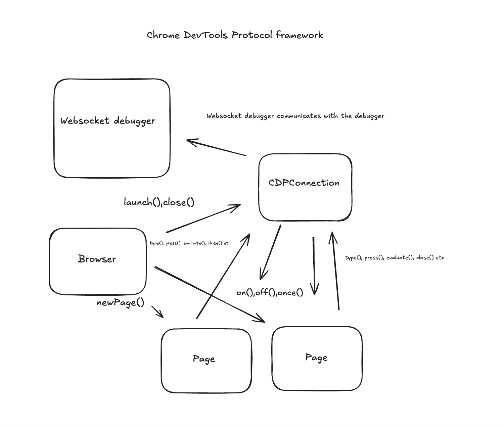

# CDP Browser Framework Examples

This is a lightweight framework to interface with the Chrome DevTools Protocol (CDP) directly.


**Usage:**

First, install packages
```bash
npm i
```

Basic example:
```bash
npm run start examples/basic-example.ts
```

Multiple targets example:
```bash
npm run start examples/multiple-targets-example.ts
```

Bears example:
```bash
npm run start examples/bears-example.ts
```

The last example goes to google, types in "Chicago Bears", Clicks on the first search result (as of 10/24/25, it is https://www.chicagobears.com), and gets the upcoming matchup. 

Finished output:

```
=== Game Information ===
Chicago Bears Record: 4-2
Opponent: Baltimore Ravens
Baltimore Ravens Record: 1-5
Location: Away
========================
```

## Architecture Overview



Looking at this diagram, there are a couple of things I want to point out:

1.) We want this to be able to manage multiple pages - each page has its own websocket URL, and as thus should be able to work independent of one another.

2.) As a developer, I should be able to create new pages, interact with a given page, and be able to respond to events happening as needed.

3.) Outside of deleting the initial tab on browser launch (which is about:blank), I tried to not be opinionated on things, at the end of the day the developer should be able to do as the wish without constraints.

Overall, the relationship between Browser -> Page -> CDPConnection is as follows:

- Browser has one connection to CDPConnection -> this is for chrome operations.

- Browser can have many connections to Page, a page has one connection to CDPConnection -> this is to handle Page events.

- Each page has a targetId, which we get from Target.createTarget, we use this to cleanup the page as needed.